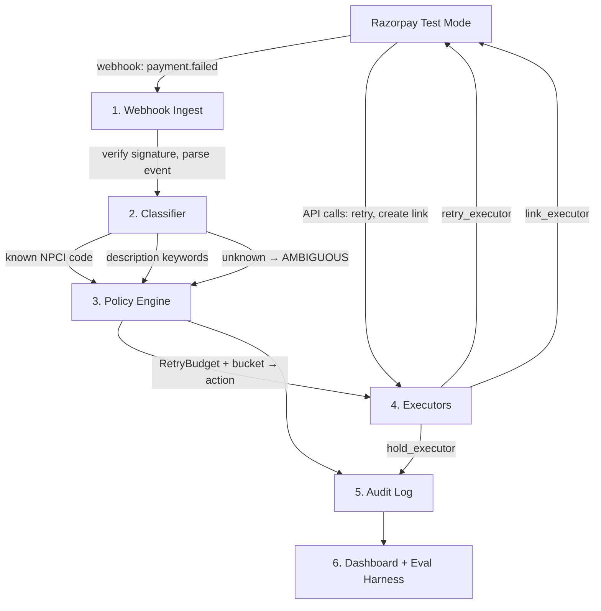
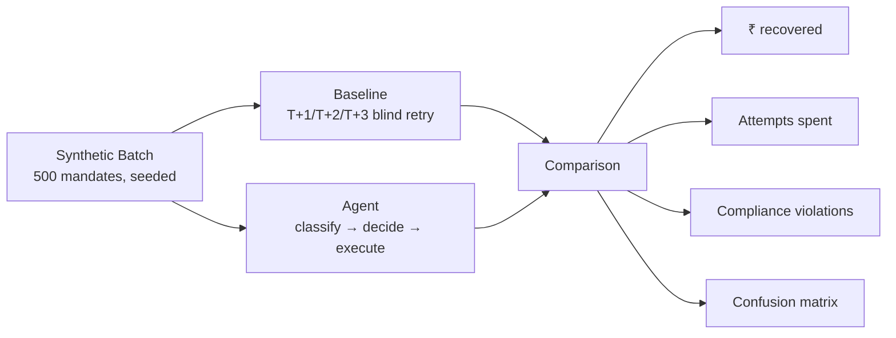

# Mandate Doctor

**Autonomous recovery agent for failed UPI AutoPay and e-NACH recurring payment mandates.**

> India runs ~1B AutoPay debits/month with bank approval as low as 10–36%. Since NPCI capped recovery at 4 attempts/cycle (Aug 2025), merchants need an agent that classifies *why* a debit failed before spending a retry on it.

**Track 03 — AI Revenue Recovery** | [Razorpay AI Buildathon 2026](https://razorpay.com/buildathon/)

---

## The Problem

India runs ~1 billion UPI AutoPay debits every month. Bank approval rates are catastrophically low — SBI approves only 36.14% of 2.13B monthly attempts, Airtel Payments Bank just 10.49%. Each failed debit costs ₹250–500 + GST in bank return charges and triggers involuntary churn.

Since Aug 2025, NPCI capped recovery at **1 attempt + max 3 retries per cycle**. But most recoverable debits historically succeeded between attempts 5–9. Brute-force retry is now illegal — merchants need intelligence, not volume.

| Fact | Source |
|---|---|
| SBI: 2.13B AutoPay txns/month, only **36.14% approved** | [Mint, Oct 2025](https://www.livemint.com/companies/start-ups/upi-autopay-failures-recurring-payments-india-11759999218161.html) |
| Airtel Payments Bank: 568.9M txns, only **10.49% approved** | Same |
| **>20M mandates revoked monthly** for insufficient balance | [psyprasad.tech, Jul 2026](https://psyprasad.tech/blog/mandate-lifecycle-nobody-models) |
| NPCI capped retries at **1+3 per cycle** (Aug 2025) | [Mint, Feb 2026](https://www.livemint.com/industry/banking/rbi-npci-upi-autopay-debits-complaints-mandates-recurring-payments-11771480657742.html) |
| Most recoverable debits succeeded at **attempts 5–9** (now illegal) | Same |
| Razorpay's Intelligent Retry recovers **only 8% more** | [Razorpay, Jun 2026](https://razorpay.com/blog/cheapest-payment-gateway-for-recurring-billing-e-nach-upi-autopay-and-subscription) |
| ~50 lakh SIPs discontinued/month (SEBI: 3 failed = ceased) | [AMFI](https://www.amfiindia.com/articles/mutual-fund) |
| UPI AutoPay failure rates: **8–15%** vs 2–3% for card mandates | [productgrowth.in, Jun 2026](https://productgrowth.in/insights/fintech/upi-autopay-guide) |
| Failure breakdown: bank timeout 35–45%, wrong PIN 20–30%, insufficient balance 15–25%, network 10–15%, account blocked 5–10% | [productgrowth.in](https://productgrowth.in/insights/fintech/upi-payment-success-rates/) citing NPCI OC-149 |
| NPCI publishes per-bank BD/TD stats monthly | [NPCI BD/TD & Uptime](https://www.npci.org.in/statistics/bd-td-and-uptime) |
| Razorpay error codes: `insufficient_funds`, `bank_technical_error`, `mandate_revoked`, etc. | [Razorpay Error Docs](https://razorpay.com/docs/errors/payments/list/) |

---

## How It Works



**Key design decisions:**
- **Never guess on money decisions.** Unknown error code → hold for review, never retry.
- **Budget is a hard counter.** Even a classifier bug can't exceed NPCI's 4-attempt cap.
- **Rules-first, AI-at-the-edge.** Known codes = boring lookup table. Ambiguous text = LLM. Restraint is the signal.

Full architecture with all diagrams: [`docs/architecture.md`](docs/architecture.md)

---

## Quick Start

```bash
git clone https://github.com/kundanjan/mandate-doctor.git
cd mandate-doctor

python3 -m venv .venv
source .venv/bin/activate
pip install -e ".[dev]"

cp .env.example .env
# Edit .env with your Razorpay test-mode keys

pytest tests/ -v
uvicorn mandate_doctor.api.app:app --reload
```

---

## Project Structure

```
mandate-doctor/
├── src/mandate_doctor/
│   ├── core/
│   │   ├── models.py        # Mandate, DebitAttempt, Decision
│   │   ├── codes.py         # NPCI return code → bucket lookup
│   │   ├── classifier.py    # Failure classifier
│   │   └── policy.py        # Decision engine + RetryBudget
│   ├── services/
│   │   ├── razorpay.py      # Razorpay API client
│   │   └── webhook_handler.py
│   ├── api/
│   │   └── routes.py        # FastAPI endpoints
│   └── audit/
│       └── logger.py        # Structured audit logging
├── tests/
│   ├── unit/                # 21 tests, all passing
│   └── integration/
├── eval/
│   ├── harness.py           # Baseline vs agent comparison
│   └── synthetic_batch.json # 500 seeded mandates
├── dashboard/
│   └── app.py               # Streamlit eval dashboard
├── docs/
│   └── architecture.md      # Full system design with Mermaid diagrams
└── pyproject.toml
```

---

## Verification

The eval harness proves the solution works by running **both approaches on the same seeded batch**:



| Metric | Baseline (T+1/T+2/T+3) | Agent (target) |
|---|---|---|
| ₹ recovered | X | ≥X + 20% |
| Attempts spent | 500 (blind) | <300 (selective) |
| Compliance violations | ~125 (retried fraud codes) | 0 |
| Precision (STOP bucket) | N/A | ≥0.95 |

Run: `python eval/harness.py`

---

## Tech Stack

Python 3.11 · FastAPI · Pydantic v2 · structlog · httpx · pytest · ruff · mypy · SQLite

---

## License

MIT
