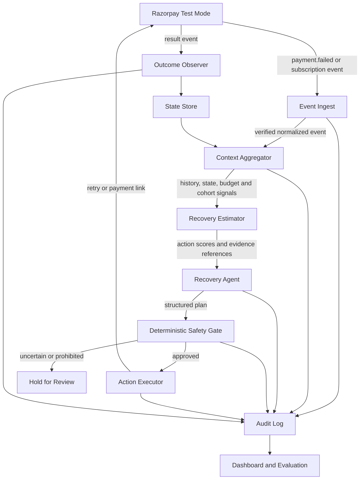
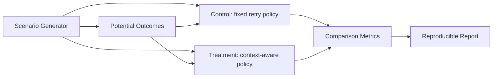

# Mandate Doctor

**A bounded recovery system for failed UPI AutoPay and e-NACH recurring payments.**

**Razorpay AI Buildathon - Track 03: AI Revenue Recovery**

## Status

This repository contains the domain models, error-code mapping, retry-budget policy, classifier baseline, tests and the initial evaluation data generator. Razorpay webhook integration, context retrieval, action execution, outcome evaluation and the dashboard are planned implementation slices.

The system does not claim production recovery uplift yet.

## Problem

Recurring-payment failures have different possible remedies. A payment can fail because of insufficient funds, a transient bank or network issue, an expired payment method, a revoked mandate, a risk decision, or an unknown condition. A fixed retry schedule cannot reliably choose the correct response when the available error information is incomplete.

Razorpay's public subscription documentation describes a failure flow that moves a subscription to `pending`, retries on the following day, and eventually moves it to `halted`. It also documents payment-method update and manual-charge flows.

The buildathon asks Track 03 projects to detect revenue at risk, determine an intervention, execute a bounded recovery workflow, measure recovered money across a batch, apply stopping rules and keep an audit trail.

Sources:

- [Razorpay AI Buildathon](https://razorpay.com/buildathon/)
- [Razorpay Subscription Payment Retries](https://razorpay.com/docs/payments/subscriptions/payment-retries/)

## Problem Evidence

These sources establish that recurring-payment failures and recovery are material payment-operations problems. They do not prove that this prototype will improve Razorpay's production recovery rate.

| Evidence | Source |
|---|---|
| NPCI-sourced reporting found large differences in AutoPay approval rates: SBI 36.14% and Airtel Payments Bank 10.49% for the reported month | [Mint, Oct 2025](https://www.livemint.com/companies/start-ups/upi-autopay-failures-recurring-payments-india-11759999218161.html) |
| Recurring UPI payments reached approximately one billion per month according to reporting citing EY India | [Mint, Feb 2026](https://www.livemint.com/industry/banking/rbi-npci-upi-autopay-debits-complaints-mandates-recurring-payments-11771480657742.html) |
| Razorpay documents payment failures, pending/halted states and fixed retry behavior | [Razorpay documentation](https://razorpay.com/docs/payments/subscriptions/payment-retries/) |
| Razorpay documents error fields such as code, source, step and reason | [Razorpay error documentation](https://razorpay.com/docs/errors/payments/list/) |
| Public engineering case studies report that payment timing can affect subscription recovery | [Stripe Smart Retries](https://stripe.com/blog/how-we-built-it-smart-retries), [Dropbox payment ML](https://dropbox.tech/machine-learning/optimizing-payments-with-machine-learning) |
| NPCI publishes bank-level Business Decline, Technical Decline and uptime statistics | [NPCI BD/TD and Uptime](https://www.npci.org.in/statistics/bd-td-and-uptime) |

The public evidence supports testing a context-aware recovery policy. It does not justify claiming a guaranteed percentage increase.

## Proposed System

Mandate Doctor does not guess the hidden bank reason behind a generic `payment_declined`. It retrieves available evidence, estimates which permitted recovery action is most useful, applies deterministic safety constraints, executes the action, and records the outcome.



## What The Recovery Agent Knows

The system can use only data that is actually available:

- Razorpay event type and event ID
- Error code, description, source, step, reason and metadata
- Mandate or subscription status
- Payment method, amount and timestamps
- Previous attempts and their observed outcomes
- Retry budget already consumed
- Merchant-level aggregate outcomes, when available

The system does not assume access to:

- A customer's current bank balance
- A customer's salary date
- A bank's private risk score
- A hidden bank-side decline reason when Razorpay does not return one

When evidence is insufficient, the correct result is abstention:

```json
{
  "selected_action": "hold_for_review",
  "abstain": true,
  "reason": "Available evidence cannot distinguish a retryable failure from a risk or mandate failure"
}
```

## AI And Agent Responsibilities

The system has separate reasoning and safety responsibilities.

### Recovery estimator

Estimates the probability that each permitted action will recover the payment. It does not assert the true cause of the original failure.

Possible implementations are:

- A transparent probability baseline for the first vertical slice
- A logistic or gradient-boosted model trained on a training split
- A ranking model for candidate retry windows
- A contextual-bandit policy after sufficient outcome data exists

### Recovery agent

The tool-using loop can:

- Retrieve additional read-only context
- Compare retry, payment-link and review options
- Select a candidate window returned by the estimator
- Explain a plan using references to observed fields
- Abstain when no action has sufficient evidence
- Observe and persist the resulting outcome

### Deterministic safety gate

The safety gate always runs before a write action. It enforces:

- Per-rail and per-cycle retry limits
- No retry for revoked, expired, closed or explicitly blocked mandates
- Idempotency keys for write actions
- Human approval for configured high-value actions
- Required evidence references

No model output can bypass the safety gate.

## Razorpay Integration Boundary

### Real test-mode path

The implementation will validate:

1. Test-mode subscription or payment creation
2. Real test-mode webhook delivery
3. `X-Razorpay-Signature` verification
4. Error-payload normalization
5. Permitted test-mode retry or payment-link calls
6. Correlation of the resulting event to the original action

### Test-mode limitation

If UPI test mode exposes only binary success/failure behavior, it cannot provide a trustworthy distribution of specific bank causes. Any enriched UPI cause used by the evaluation must be marked synthetic.

Documented card fixtures can provide additional error responses. Each fixture will record whether it came from a real Razorpay test response or from the evaluation environment.

## How The Result Is Verified

There are three different levels of verification.

### 1. Integration verification

This proves that the implementation works with Razorpay's test-mode contract. It does not prove business uplift.

### 2. Controlled policy evaluation

The evaluation environment creates scenarios with a hidden state and independent potential outcomes. The recovery system cannot read the hidden state.



The control and treatment receive the same scenarios and outcome table. The outcome environment is independent of the selected policy, so the treatment cannot receive favorable outcomes by construction.

### 3. Production experiment

Actual production uplift requires consented real merchant traffic and random assignment:

```text
eligible failed mandate cycles
  -> control or treatment assignment
  -> same eligibility and communication rules
  -> measure recovered cycle and amount
  -> monitor safety and customer-impact guardrails
```

The buildathon prototype will not claim this level of proof without such an experiment.

## Evaluation Protocol

The evaluation must follow these rules:

- Use a fixed eligible-cycle denominator
- Compare against the documented fixed retry policy, not an invented weak baseline
- Use the same scenarios, amounts and initial histories for both policies
- Keep hidden scenario labels inaccessible to the system
- Separate training, development and holdout seeds
- Run multiple random seeds
- Test balanced, technical-heavy, low-balance-heavy and hard-stop-heavy distributions
- Include generic declines with no description or useful context
- Run sensitivity analysis over assumed recovery probabilities
- Report confidence intervals
- Preserve every failed or inconclusive result

### Primary metric

```text
cycle recovery rate = recovered eligible mandate cycles / eligible failed mandate cycles
```

### Secondary metrics

| Metric | Definition |
|---|---|
| Recovered amount | Sum of confirmed recovered amounts |
| Absolute lift | Treatment rate minus control rate |
| Relative lift | Absolute lift divided by control rate |
| Attempts per recovered cycle | Total retry attempts divided by recovered cycles |
| Hard-stop violations | Automated actions on prohibited mandates; target zero |
| Budget violations | Actions beyond the configured cap; target zero |
| Abstention precision | Held cases that should not have been automated |
| Audit completeness | Plans with evidence, policy result, idempotency key and outcome |
| Time to resolution | Failure timestamp to recovered or final state |

No recovery target is hardcoded before measurement. If the confidence interval includes zero, the result is inconclusive. If treatment performs worse, that result remains in the report.

## Synthetic Data Contract

The existing batch generator creates failed attempts. It is not sufficient to prove recovery uplift until an independent outcome environment is implemented.

Each evaluation scenario will contain:

```json
{
  "scenario_id": "sc_0001",
  "observed_event": {},
  "hidden_label_for_evaluation_only": "technical",
  "potential_outcomes": {},
  "source_basis": [
    "Razorpay error schema",
    "NPCI decline categories",
    "published payment-retry evidence"
  ],
  "assumptions": [
    "technical failures have a non-zero recovery probability after delay"
  ]
}
```

The hidden label and potential outcomes are simulator assumptions. They are not real bank diagnoses or real merchant revenue.

## Repository Structure

```text
mandate-doctor/
├── src/mandate_doctor/
│   ├── core/
│   │   ├── models.py
│   │   ├── codes.py
│   │   ├── classifier.py
│   │   ├── policy.py
│   │   └── estimator.py             # planned
│   ├── services/
│   │   ├── razorpay.py              # planned
│   │   ├── webhook_handler.py       # planned
│   │   └── action_executor.py       # planned
│   ├── api/
│   │   └── routes.py                # planned
│   └── audit/
│       └── logger.py                # planned
├── tests/
│   ├── unit/
│   └── integration/
├── eval/
│   ├── generate_batch.py
│   ├── outcome_environment.py       # planned
│   └── harness.py                   # planned
├── dashboard/
│   └── app.py                       # planned
├── docs/
│   └── architecture.md
├── .env.example
├── pyproject.toml
└── README.md
```

## Current Commands

```bash
python3 -m venv .venv
source .venv/bin/activate
pip install -e ".[dev]"
pytest tests/ -v
python eval/generate_batch.py
```

The API and dashboard commands will be added when those components exist. Documentation will not advertise unimplemented commands as working features.

## Current Implementation

Implemented:

- Pydantic domain models
- Razorpay-style error-code mapping
- Deterministic and description-pattern classifier baseline
- Retry-budget policy with safe exhaustion behavior
- Unit tests for current classifier and policy behavior
- Seeded failed-attempt generator

Next implementation slices:

1. Independent outcome environment and control/treatment harness
2. Recovery context store and action-score contract
3. Razorpay webhook ingestion and signature verification
4. Tool interfaces and deterministic safety gate
5. Test-mode action executors and outcome observer
6. Dashboard for real integration and simulated evaluation results

## License

MIT
