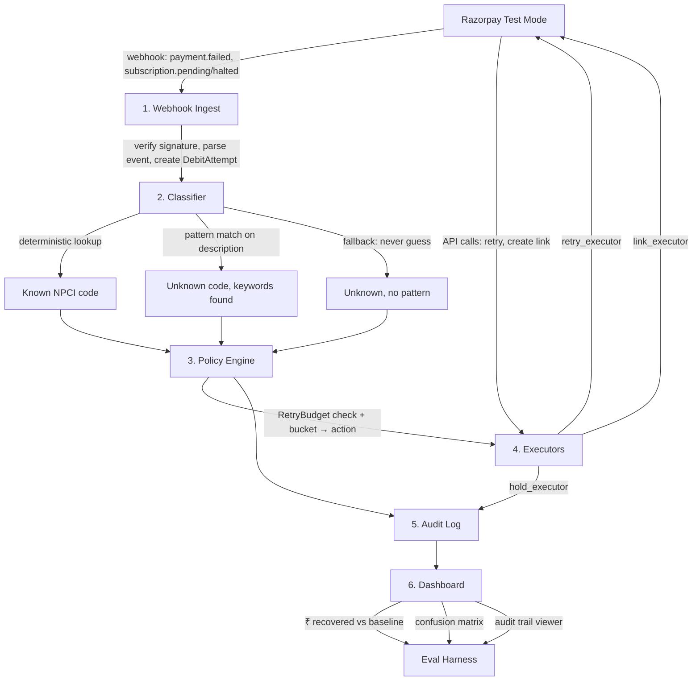
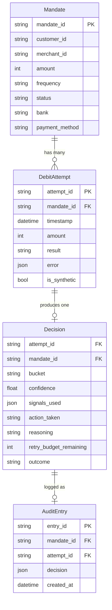
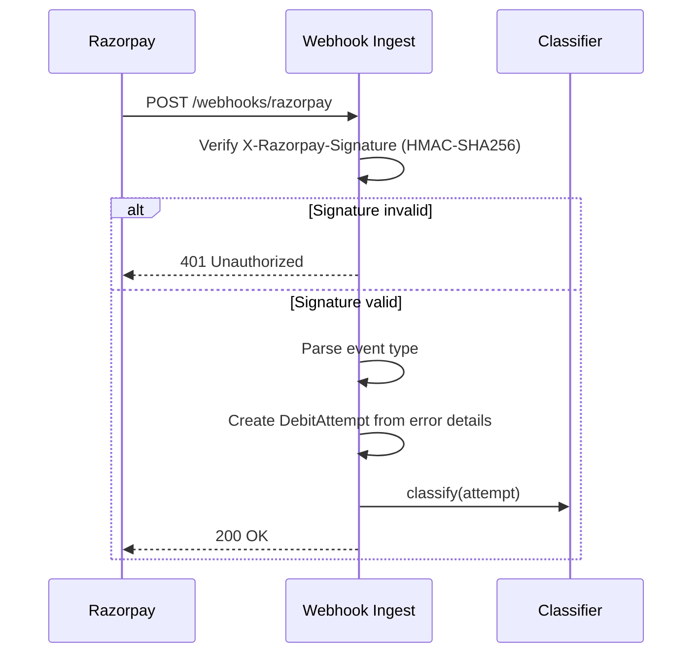
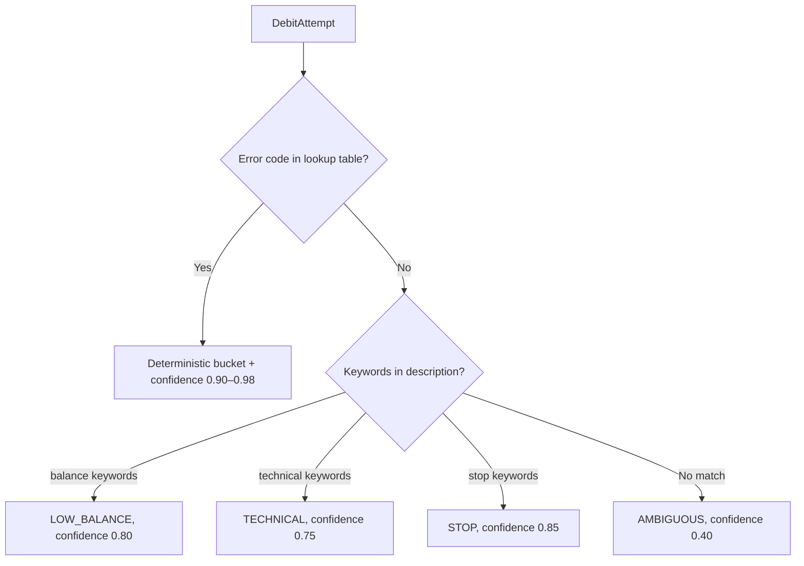
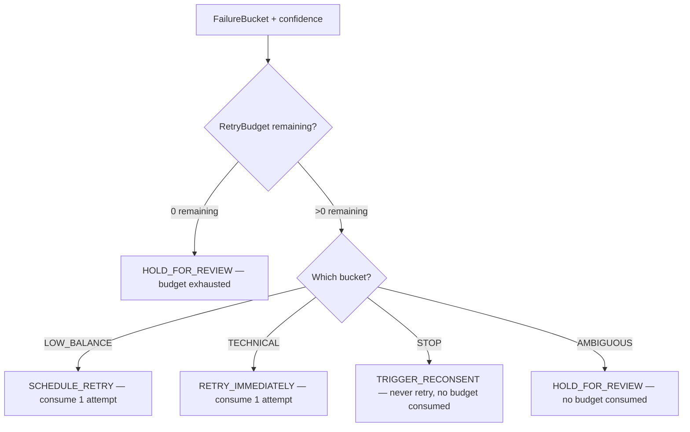
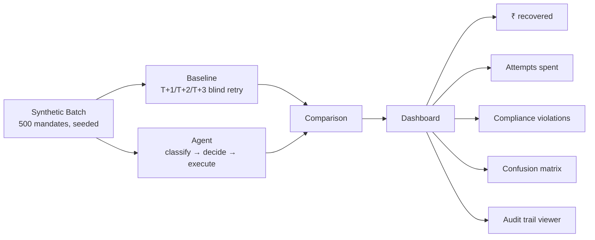

# Mandate Doctor — Architecture

## Problem

India runs ~1 billion UPI AutoPay debits/month. Bank approval rates are as low as 10–36% (SBI: 36.14%, Airtel Payments Bank: 10.49%). Each failed debit costs ₹250–500 + GST in bank return charges and triggers involuntary churn — >20M mandates revoked monthly for insufficient balance alone.

Since Aug 2025, NPCI capped recovery at **1 attempt + max 3 retries per cycle**. Historically, most recoverable debits succeeded between attempts 5–9. Brute-force retry is now illegal. Merchants need an agent that **classifies why a debit failed** before spending a retry on it.

**Evidence:** `buildathon-evidence.md` in repo root (29 primary sources, freshness-audited).

---

## System Overview



---

## Data Model



### ErrorDetail (mirrors Razorpay's error schema)

| Field | Type | Example |
|---|---|---|
| code | str | `insufficient_funds`, `mandate_revoked` |
| description | str | Human-readable error message |
| source | str | `bank`, `gateway`, `customer` |
| step | str | `payment`, `authentication`, `authorization` |
| reason | str | Additional context |
| metadata | dict | Bank-specific extra fields |

---

## Component Details

### 1. Webhook Ingest



**Responsibilities:**
- Verify `X-Razorpay-Signature` before processing any event
- Parse `payment.failed`, `subscription.pending`, `subscription.halted` events
- Extract error code, description, source, step from Razorpay's error schema
- Create DebitAttempt and pass to classifier
- For UPI test mode: enrich binary `failure@razorpay` with synthetic reason codes (disclosed in README — sandbox limitation, not a shortcut)

### 2. Classifier



**Three layers, in order:**

| Layer | When | Confidence | Example |
|---|---|---|---|
| Deterministic lookup | Known NPCI error code | 0.90–0.98 | `insufficient_funds` → LOW_BALANCE |
| Pattern match | Unknown code, description has keywords | 0.75–0.85 | "gateway timeout" → TECHNICAL |
| Fallback | Unknown code, no pattern | 0.40 | Anything else → AMBIGUOUS |

**Design principle:** Never guess on money decisions. Unknown = hold for review.

### 3. Policy Engine



**Bucket → Action mapping:**

| Bucket | Action | Budget consumed? | Timing |
|---|---|---|---|
| LOW_BALANCE | SCHEDULE_RETRY | Yes | +5 days (salary window heuristic) |
| TECHNICAL | RETRY_IMMEDIATELY | Yes | +5s, +1h, +24h backoff |
| STOP | TRIGGER_RECONSENT | No | Immediate (new consent flow) |
| AMBIGUOUS | HOLD_FOR_REVIEW | No | Human picks action |

**Fail-safe:** `retry_budget.consume()` returns False when exhausted → action forced to HOLD_FOR_REVIEW regardless of bucket. This is the NPCI 1+3 cap enforcement — even a classifier bug can't blow the budget.

### 4. Executors

| Executor | What it does | Razorpay API | When triggered |
|---|---|---|---|
| retry_executor | Retries the debit at scheduled time | Orders API + Payments API | LOW_BALANCE, TECHNICAL |
| link_executor | Creates Payment Link + sends dunning notification | Payment Links API | LOW_BALANCE (fallback) |
| hold_executor | Logs hold decision, no API call | None (audit only) | STOP, AMBIGUOUS, budget exhausted |

### 5. Audit Log

Every Decision is persisted as a structured JSON entry:

```json
{
    "entry_id": "aud_xxx",
    "mandate_id": "md_xxx",
    "attempt_id": "att_xxx",
    "decision": {
        "bucket": "low_balance",
        "confidence": 0.95,
        "signals_used": ["known_code:insufficient_funds"],
        "action_taken": "schedule_retry",
        "reasoning": "Error code 'insufficient_funds' maps to low_balance (deterministic)",
        "retry_budget_remaining": 2
    },
    "created_at": "2026-08-23T10:30:00Z"
}
```

This is the "explainable, bounded, gated" artifact the track bar demands.

### 6. Dashboard + Eval Harness



---

## How We Verify It Works

### The Eval Harness

Runs both approaches on the **same synthetic batch** and compares:

**Synthetic batch design (500 mandates, seeded):**

| Bucket | % of batch | Count | Ground truth |
|---|---|---|---|
| LOW_BALANCE | 45% | 225 | Retryable, 70% succeed on retry |
| TECHNICAL | 20% | 100 | Retryable, 90% succeed on retry |
| STOP | 25% | 125 | Never retryable, 0% succeed |
| AMBIGUOUS | 10% | 50 | Mixed, unknown to agent |

Same random seed every run → reproducible results.

### Metrics

| Metric | What it proves | How measured |
|---|---|---|
| ₹ recovered | Agent recovers more revenue | Sum of successful retries × amount |
| Attempts spent | Agent uses budget wisely | Count of retry actions taken |
| Compliance violations | Agent never retries STOP codes | Count of retries on fraud/revoked mandates |
| Precision per bucket | Classifier is accurate | TP / (TP + FP) per bucket |
| Recall per bucket | Classifier doesn't miss recoverable | TP / (TP + FN) per bucket |
| False-positive cost | Wrong retries are expensive | ₹ lost on retries that shouldn't have happened |

### Baseline: Razorpay's Default Behavior

From Razorpay's own docs: fixed T+1/T+2/T+3 retry for all failures, then `halted`. No classification, no timing intelligence, no stopping for fraud codes.

The baseline wastes retries on STOP codes (compliance violations), doesn't time retries to salary windows, and burns the 4-attempt budget on unrecoverable cases.

### Target

| Metric | Baseline | Agent |
|---|---|---|
| ₹ recovered | X | ≥X + 20% |
| Attempts spent | 500 (blind) | <300 (selective) |
| Compliance violations | ~125 | 0 |
| Precision (STOP) | N/A | ≥0.95 |

---

## Test Strategy

### Unit Tests (21 passing)
- Classifier: deterministic lookup, pattern matching, ambiguous fallback, case insensitivity, no-error-detail
- Policy: retry budget capacity/consume/reset/exhaustion, decisions per bucket, budget exhaustion forces hold

### Integration Tests
- Webhook → Classifier → Policy → Decision (end-to-end with mock Razorpay)
- Webhook signature verification (valid + invalid)
- Synthetic batch runs without errors

### Eval Tests
- Run eval harness on seeded batch
- Assert: agent ₹ recovered > baseline ₹ recovered
- Assert: agent compliance violations == 0
- Assert: agent attempts spent < baseline attempts spent
- Print confusion matrix

---

## Tech Stack

| Component | Choice | Why |
|---|---|---|
| Language | Python 3.11+ | Fast prototyping, strong typing |
| HTTP framework | FastAPI | Async, auto-docs, Pydantic integration |
| HTTP client | httpx | Async Razorpay API calls |
| Validation | Pydantic v2 | Type-safe models |
| Logging | structlog | Structured JSON logs |
| Testing | pytest + pytest-asyncio | Industry standard |
| Linting | ruff | Fast, replaces flake8+isort+black |
| Type checking | mypy --strict | Catch errors before runtime |
| Database | SQLite (dev), Postgres (prod) | Zero config for hackathon |
| Dashboard | Streamlit | Fast UI for eval results |
