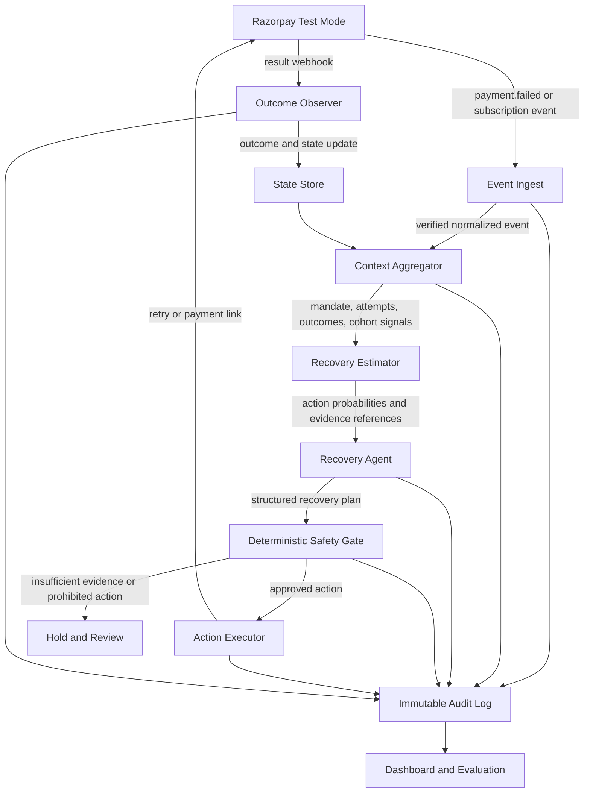
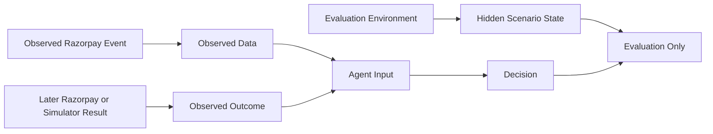
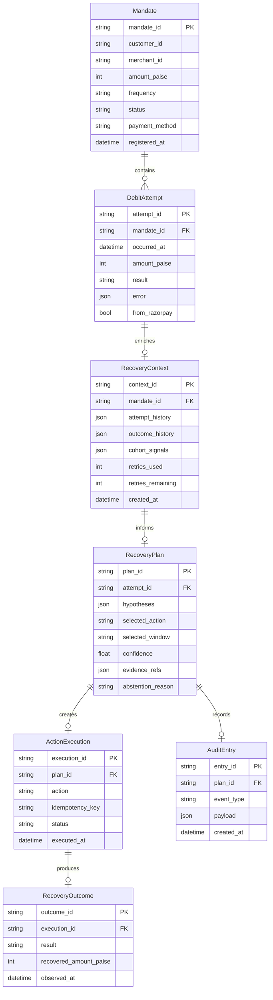
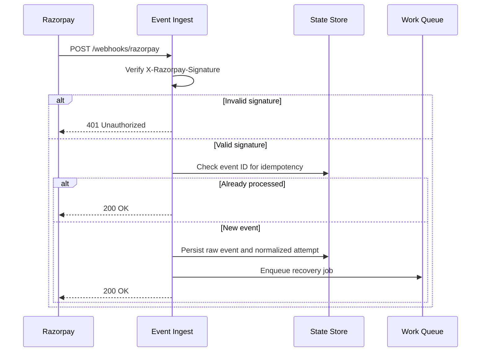
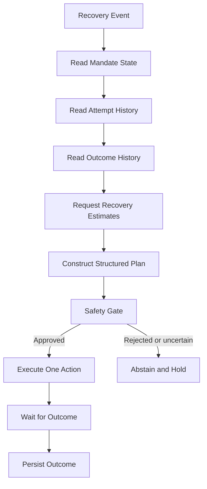
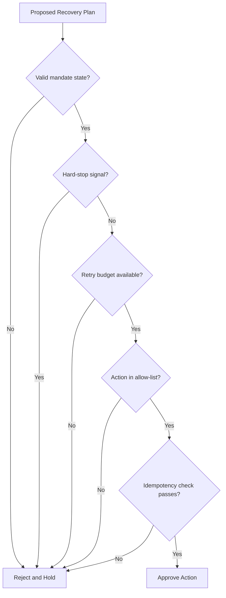

# Mandate Doctor - System Architecture

## 1. Purpose and Scope

Mandate Doctor is an event-driven recovery system for failed recurring payments. It is designed for Razorpay test mode and covers the following workflow:

```text
payment failure
  -> retrieve available context
  -> estimate recovery options
  -> select a bounded action
  -> execute through an approved tool
  -> observe the outcome
  -> update the mandate history
```

This document separates four different claims:

| Claim | What can support it |
|---|---|
| Failed recurring payments are a real problem | NPCI, RBI, AMFI, Razorpay and independent industry evidence |
| Retry timing and action selection can affect recovery | Production case studies and controlled experiments from other payment companies |
| The prototype integrates correctly with Razorpay | Real Razorpay test-mode objects, webhooks and API responses |
| This prototype improves recovery for real merchants | A controlled experiment with real merchant traffic; not available in this buildathon |

The prototype must never present simulated recovery as real merchant revenue.

## 2. Problem Definition

Recurring-payment failures do not all have the same remedy. A failed debit may be caused by insufficient funds, a temporary technical failure, an expired payment method, a revoked mandate, a risk decision, or an unknown condition.

Razorpay's public subscription documentation describes a default lifecycle in which a failed subscription becomes `pending`, is retried on the following day, and eventually becomes `halted` after the retry cycle. It also documents customer card-update and manual-charge flows.

Sources:

- [Razorpay Buildathon - AI Revenue Recovery](https://razorpay.com/buildathon/)
- [Razorpay Subscription Payment Retries](https://razorpay.com/docs/payments/subscriptions/payment-retries/)
- [Razorpay Payment Error Schema](https://razorpay.com/docs/errors/payments/list/)

The opportunity is not to claim that Razorpay has no recovery feature. The opportunity is to build a merchant-visible recovery policy layer that:

- Retrieves context across the failed payment and its mandate history
- Chooses among several permitted recovery actions
- Makes uncertainty explicit instead of inventing a failure reason
- Enforces retry and risk limits outside the reasoning layer
- Observes outcomes and evaluates policy performance
- Produces a complete audit trail

## 3. Evidence and Design Rationale

The following sources support the mechanism behind the design. They do not prove that Mandate Doctor will achieve the same results on Razorpay or UPI.

| Source | Relevant finding | Use in this system |
|---|---|---|
| [Stripe Smart Retries](https://stripe.com/blog/how-we-built-it-smart-retries) | Retry timing can be predicted from payment, customer, billing and time-dependent signals | Justifies a recovery-time estimator |
| [Dropbox payment ML](https://dropbox.tech/machine-learning/optimizing-payments-with-machine-learning) | Dropbox used A/B tests to establish that charge timing affected success before shipping a ranking model | Justifies control/treatment evaluation |
| [Razorpay payment-retry docs](https://razorpay.com/docs/payments/subscriptions/payment-retries/) | Publicly documented retry lifecycle and pending/halted states | Defines the control-policy baseline and integration contract |
| [Razorpay error docs](https://razorpay.com/docs/errors/payments/list/) | Error responses expose structured fields such as code, source, step and reason | Defines normalized evidence fields |

The system must not infer a hidden bank cause from an empty `payment_declined` response. It estimates which permitted action is most likely to recover value based on observed evidence. If no action has sufficient evidence, it abstains.

## 4. System Overview



## 5. Data Boundaries

The system has three data categories. Keeping them separate prevents the evaluation from overstating what is known.



### Observed data

Data the system is allowed to use:

- Razorpay event ID and event type
- Error code, description, source, step, reason and metadata
- Mandate or subscription status
- Amount, currency, payment method and timestamps
- Previous attempts and their outcomes
- Retry attempts already consumed in the current cycle
- Merchant-level aggregate outcomes, if available

### Hidden scenario state

The evaluation environment may contain a hidden label such as `LOW_BALANCE`, `TECHNICAL`, `STOP` or `UNKNOWN`. The agent cannot read this label. It exists only to score the decision against a controlled environment.

The hidden label is a simulator label, not a real bank diagnosis.

### Observed outcome

After an action, the system records what happened:

- Payment recovered after the action
- Payment failed again
- Customer completed a payment link
- Mandate was revoked or expired
- Action was rejected by a safety gate
- Human review accepted or rejected the plan

An outcome does not necessarily prove the original hidden cause. For example, a later successful retry proves that the retry worked, not that the original decline was definitely a technical failure.

## 6. Domain Model



### Important model distinction

`hypotheses` are probabilistic assessments. `outcome` is what was observed later. They must not be stored in the same field or represented as the same certainty.

## 7. Component Design

### 7.1 Event Ingest



Responsibilities:

- Verify the webhook signature before parsing business data
- Deduplicate by Razorpay event ID
- Persist the raw payload without exposing secrets in logs
- Normalize supported event types into `DebitAttempt`
- Return promptly and process recovery asynchronously

The first implementation should support `payment.failed`, `subscription.pending` and `subscription.halted` fixtures. It must preserve the raw payload for debugging while redacting credentials and unnecessary personal data.

### 7.2 Context Aggregator

The context aggregator reads data before any write action is considered.

Read operations:

- Load the mandate or subscription
- Load the failed payment
- Load previous attempts for the mandate
- Load previous recovery outcomes
- Calculate retries used and retries remaining
- Calculate merchant or cohort-level failure rates where data exists

No bank balance, salary date or private bank risk score is assumed. A signal may be used only when it is present in the input data and its provenance is recorded.

### 7.3 Recovery Estimator

The estimator predicts action outcomes. It does not claim to identify the bank's hidden cause.

Example output:

```json
{
  "action_scores": [
    {
      "action": "schedule_retry",
      "expected_recovery_probability": 0.68,
      "evidence_refs": ["attempt_history:4", "cohort_signal:2"]
    },
    {
      "action": "create_payment_link",
      "expected_recovery_probability": 0.44,
      "evidence_refs": ["payment_method:upi"]
    }
  ],
  "uncertainty": 0.32,
  "abstain": false
}
```

Possible estimator implementations:

1. Transparent baseline probabilities for the first end-to-end slice
2. A logistic or gradient-boosted model trained on a training split
3. A ranking model that orders retry windows or recovery actions
4. A contextual-bandit policy after enough outcome data exists

The buildathon prototype must report which implementation is actually running. It must not imply that a model is trained on Razorpay production data when it is trained on synthetic data.

### 7.4 Recovery Agent

The recovery agent is a tool-using planning loop. Its job is to gather evidence and select an action from an allowed action set.



The agent may:

- Choose which read-only context tool to call next
- Compare retry, payment-link and human-review options
- Select a candidate retry window returned by the estimator
- Explain its selection using references to observed fields
- Abstain when evidence is insufficient
- Observe the result and update state

The agent may not:

- Invent a bank balance or salary date
- Convert a generic decline into a certain diagnosis
- Override the retry budget
- Retry a revoked, expired or explicitly blocked mandate
- Create an action outside the policy's allow-list
- Mark a payment recovered without an observed result

### 7.5 LLM Boundary

An LLM is optional inside the planning component. It can help select read-only tools, summarize evidence and produce a structured recovery plan. It is not the source of truth for payment state or safety policy.

For an empty or generic failure response:

```json
{
  "code": "payment_declined",
  "description": ""
}
```

the valid result may be:

```json
{
  "selected_action": "hold_for_review",
  "abstain": true,
  "reason": "Available evidence cannot distinguish a retryable failure from a risk or mandate failure"
}
```

If the LLM is unavailable or returns invalid structured output, the system must fall back to `HOLD_FOR_REVIEW`. It must not replace the LLM with an imitation rule set and call that AI.

### 7.6 Deterministic Safety Gate

The safety gate runs after planning and before every write action.



Rules:

- Enforce the configured per-rail and per-cycle retry cap
- Do not retry revoked, expired, closed or explicitly fraud-blocked mandates
- Require an idempotency key for every write action
- Require human approval for configured high-value actions
- Reject plans with missing evidence references
- Record every rejection and reason

The policy owns safety. No model or LLM output can bypass it.

### 7.7 Action Executors

| Action | Purpose | External operation | Safety requirements |
|---|---|---|---|
| `schedule_retry` | Queue a permitted retry window | Razorpay-supported payment operation or test adapter | Budget, mandate state and idempotency checks |
| `retry_immediately` | Retry a transient failure | Razorpay test-mode payment operation | Technical evidence and budget required |
| `create_payment_link` | Give the customer an alternative recovery path | Razorpay Payment Links API | Amount, expiry and duplicate-link checks |
| `hold_for_review` | Stop automation safely | No payment API call | Audit reason required |
| `trigger_reconsent` | Request a new mandate or payment method | Hosted checkout or re-consent flow | Existing mandate must not be retried |

The executor returns an execution record. It does not decide whether an action is appropriate.

### 7.8 Outcome Observer

The outcome observer maps later Razorpay events or test-adapter results back to the original plan:

- Match by payment ID, subscription ID, mandate ID and idempotency key
- Mark the action as `recovered`, `failed`, `pending`, `rejected` or `unknown`
- Record recovered amount only when the payment result is confirmed
- Append the result to the mandate's outcome history
- Never overwrite the original decision or audit record

## 8. Razorpay Test-Mode Integration Boundary

Razorpay test mode validates integration behavior, not real bank economics.

### Real integration path

- Create test-mode subscription or payment objects
- Receive real test-mode webhook payloads
- Verify webhook signatures
- Parse Razorpay error fields
- Create permitted test-mode payment operations or links
- Observe resulting test-mode events

### UPI limitation

If the UPI sandbox exposes only binary success/failure behavior, it cannot provide a reliable distribution of specific bank causes. The implementation must label any added UPI failure reason as synthetic evaluation data.

### Card limitation

Documented card test cases can provide more varied error responses. Each fixture must record whether it came from a real Razorpay test response or from the evaluation environment.

## 9. Evaluation Design

### 9.1 What the evaluation proves

The evaluation can prove that, under documented simulator assumptions, one policy performs better than another on the same scenarios. It cannot prove production uplift.

### 9.2 Outcome environment

The current batch generator creates failed attempts but does not yet model post-action outcomes. The next evaluation slice must add an independent outcome environment.

For every scenario, generate potential outcomes for each allowed action and candidate window before running either policy:

```text
scenario -> potential outcome table
                     |-- fixed retry at T+1
                     |-- fixed retry at T+2
                     |-- fixed retry at T+3
                     |-- scheduled retry at window A
                     |-- payment link
                     |-- hold
```

Both control and treatment read from the same potential-outcome table. The treatment cannot change the outcome model in its own favor.

### 9.3 Control and treatment

**Control:** documented fixed retry policy represented by the supported test adapter:

```text
T+1 -> T+2 -> T+3 -> halted
```

The control is a documented baseline, not a claim about every internal Razorpay system.

**Treatment:** context-aware recovery policy:

```text
retrieve context -> estimate action outcomes -> plan -> safety gate -> execute -> observe
```

Both policies receive the same initial scenarios, amounts, mandate histories and outcome environment.

### 9.4 Synthetic scenario provenance

Every generated scenario must include:

```json
{
  "scenario_id": "sc_0001",
  "observed_event": {},
  "hidden_label_for_evaluation_only": "technical",
  "potential_outcomes": {},
  "source_basis": [
    "Razorpay error schema",
    "NPCI decline categories",
    "published industry retry evidence"
  ],
  "assumptions": [
    "technical failures have a non-zero recovery probability after delay"
  ]
}
```

The hidden label and probabilities are assumptions of the evaluation environment. They are not observed bank facts.

### 9.5 Robustness checks

Do not tune the policy and evaluate it on the same records.

Use:

- Training, development and holdout scenario seeds
- At least four independently generated seeds
- Low-balance-heavy, technical-heavy, hard-stop-heavy and balanced distributions
- Unseen combinations of amount, timing, payment method and failure code
- Adversarial generic declines with no usable context
- Sensitivity analysis over every assumed recovery probability
- Bootstrap confidence intervals for the difference between policies

The result should be reported as a range across environments, not as one favorable run.

### 9.6 Metrics

Primary metric:

```text
cycle recovery rate = recovered eligible mandate cycles / eligible failed cycles
```

Additional metrics:

| Metric | Definition |
|---|---|
| Recovered amount | Sum of confirmed recovered amounts |
| Absolute lift | Treatment recovery rate - control recovery rate |
| Relative lift | Absolute lift / control recovery rate |
| Attempts per recovered cycle | Total retry attempts / recovered cycles |
| Hard-stop violations | Automated retries on prohibited mandates; target 0 |
| Budget violations | Actions beyond configured retry cap; target 0 |
| Abstention precision | Held cases that should not have been automated |
| Action precision | Actions whose simulated or observed outcome matched the allowed objective |
| Audit completeness | Actions with evidence, policy result, idempotency key and outcome |
| Time to resolution | Failure timestamp to recovered or final state |

Do not set a recovery target such as “20% improvement” before running the evaluation. Report the measured result and uncertainty.

### 9.7 Results format

```text
Evaluation environment: seed=42, distribution=balanced
Eligible cycles: 500
Control recovery rate: <measured value>
Treatment recovery rate: <measured value>
Absolute lift: <measured value>
95% interval: <measured interval>
Hard-stop violations: 0
Budget violations: 0
Assumptions changed: none
```

If the interval includes zero, the result is inconclusive. If treatment loses, the system must show that result rather than changing the denominator.

### 9.8 Production proof requirement

Actual production uplift requires a consented, randomized experiment:

```text
eligible failed mandate cycles
    -> randomly assign control or treatment
    -> keep eligibility and communication rules constant
    -> measure recovery per cycle
    -> monitor safety and customer-impact guardrails
```

The buildathon prototype cannot claim this level of proof without real merchant traffic and an approved experiment.

## 10. Audit Record

Each recovery plan and action must produce an append-only record:

```json
{
  "entry_id": "audit_0001",
  "event_type": "recovery_plan_created",
  "mandate_id": "md_0001",
  "attempt_id": "att_0001",
  "observed_evidence": [
    "error.code",
    "mandate.status",
    "attempt_history.count",
    "retry_budget.remaining"
  ],
  "hypotheses": [
    {
      "label": "technical",
      "probability": 0.68,
      "evidence_refs": ["attempt_history:4", "cohort_signal:2"]
    }
  ],
  "selected_action": "schedule_retry",
  "policy_result": "approved",
  "idempotency_key": "retry_md_0001_cycle_02",
  "outcome": null,
  "created_at": "2026-08-23T10:30:00Z"
}
```

The audit record must make it possible to answer:

- What did the system observe?
- What did it believe, and with what uncertainty?
- Which action did it select?
- Which policy allowed or rejected it?
- What happened afterward?
- Which data came from Razorpay and which came from the evaluation environment?

## 11. Dashboard

The dashboard must display:

- Real Razorpay test-event processing status
- Control and treatment denominators
- Recovery rate and recovered amount
- Absolute and relative lift with uncertainty interval
- Attempts per recovered cycle
- Hard-stop and budget violations
- Abstention count and reasons
- Assumptions and scenario seed used for each evaluation
- Searchable audit records
- Real integration results separately from simulated results

The dashboard must not combine simulated amounts with real Razorpay test-mode amounts.

## 12. Test Strategy

### Unit tests

- Error normalization
- Context construction
- Action-score calculation
- Abstention when evidence is insufficient
- Retry-budget enforcement
- Hard-stop enforcement
- Idempotency-key generation
- Audit-record construction

### Integration tests

- Valid and invalid webhook signatures
- Duplicate webhook delivery
- Webhook to context to plan flow
- Safety gate rejection
- Razorpay test adapter request and response mapping
- Outcome event correlation

### Evaluation tests

- Same scenario table is used by control and treatment
- Treatment cannot access hidden labels
- Multiple seeds produce reproducible results
- Holdout scenarios are not used for tuning
- Sensitivity analysis runs successfully
- Zero budget violations under adversarial plans
- Inconclusive results are reported as inconclusive

## 13. Implementation Status

Implemented:

- Domain models for mandates, attempts, decisions and audit entries
- Razorpay-style error-code lookup table
- Basic deterministic classification
- Retry budget and policy skeleton
- Unit tests for current classifier and policy behavior
- Initial synthetic failed-attempt generator

Required for the complete system:

- Independent outcome environment
- Recovery context store
- Tool interfaces for read and write operations
- Recovery planning loop
- Deterministic safety gate around every write action
- Razorpay webhook ingestion and signature verification
- Razorpay test-mode adapter
- Outcome observer
- Evaluation harness with control/treatment comparison
- Dashboard with separate real and simulated result views

## 14. Technology Choices

| Component | Choice | Responsibility |
|---|---|---|
| Language | Python 3.11+ | Domain and service implementation |
| HTTP framework | FastAPI | Webhooks and API endpoints |
| Validation | Pydantic v2 | Boundary and domain validation |
| HTTP client | httpx | Razorpay test-mode calls |
| State store | SQLite for prototype | Mandates, events, plans and outcomes |
| Logging | structlog | Structured operational logs |
| Evaluation | pytest and custom harness | Unit, integration and policy evaluation |
| Dashboard | Streamlit | Evaluation and audit views |
| Quality | Ruff and mypy | Linting, formatting and type checks |
